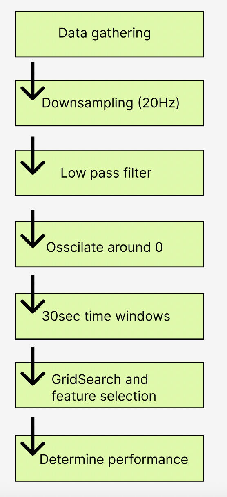

# RP

# CSE3000-Detect chewing episodes on an Inertial Measurement Unit (IMU) around the ear
The code and data in this repo were used to write the bachelors thesis paper about "detecting chewing episodes on an Inertial Measurement Unit (IMU) around the ear". (http://repository.tudelft.nl/, 06-2023).

  
   
   

### File/data convertion
The above image shows the steps that were taken during the experiment.
The datafiles were transformed step by step and stored in new temporary files. The csvconverter.py contains functions to store and read the needed datafiles.

### Data gathering 
Data was gathered on 5 different days, and the imu data can be found in the following folders: 
* 11-06-2023: ./usedData/1106
* 12-06-2023: ./usedData/1206
* 13-06-2023: ./usedData/1306
* 20-06-2023: ./usedData/2006
* 21-06-2023: ./usedData/2106

To gather data, use the files in the ./imu setup folder. Make sure that in settings, the correct COM port is used, and determine the measurement time. In serial_connection.py insert the name of the new txt file. To start collecting data with the sensor, run the serial_connection.py file.

The activity, aswell as the duration were later manually added at the top of the raw data file.

### Downsampling
The changerate.py file contains the function that samples the imu data to a different sample rate. In this experiment, 20Hz was chosen. The duration of each measured activity in seconds should be provided as input too. The duration of each activity can be found in the headers of the textfiles of the raw imu data (in the folders mentioned in the previous section).

The downsampled files are stored as the orginal filename + "_[samplerate]hz" 

### Low pass filter and oscillate around 0
The butterworth.py file contains the functon that passes the data through a low pass filter, and then moves the axis data to oscillate around 0.

The files are stored in ./butteredAndNorm as "BN" + filename

### 30 sec time window
transformData.py contains the functions needed to extract features per 30 second time window. 

The files with extracted features per window are stored in ./featurs as  "F" + filename. 
The labels of the windows are also stored as "FLabel" + filename. 
The name of the activity are stored as "FName" + filename. This file can be used to see how each activity was classified.

### Gridsearch and feature selection
In transformAll.py, the gridsearch parameters are defined in this file.
This file contains code that was used to perform gridsearch and calls the sequential forward feature selection in selection.py to do a feature selection. This file also writes the performance as accuracy and f1-score to the terminal.

### Determine performance
This repository consists of the tools used for analysing, processing and training of the audio used for writing the paper for CSE3000-Detect chewing episodes on an Inertial Measurement Unit (IMU) around the ear. An electronic version of the thesis is available at http://repository.tudelft.nl/
The performance of the machinelearning models as well as more informationn about the experiment can be found.

